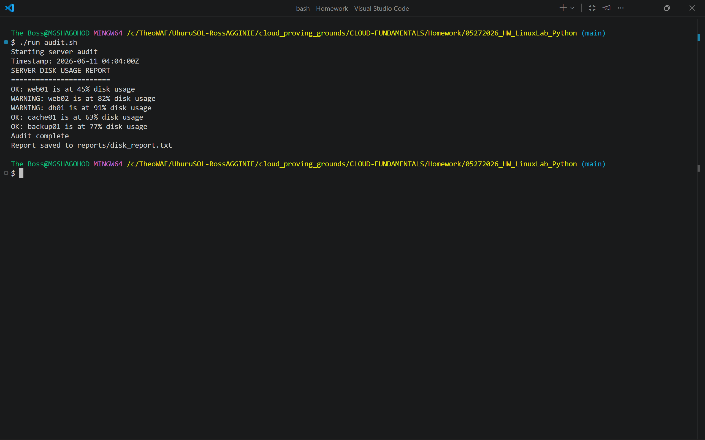
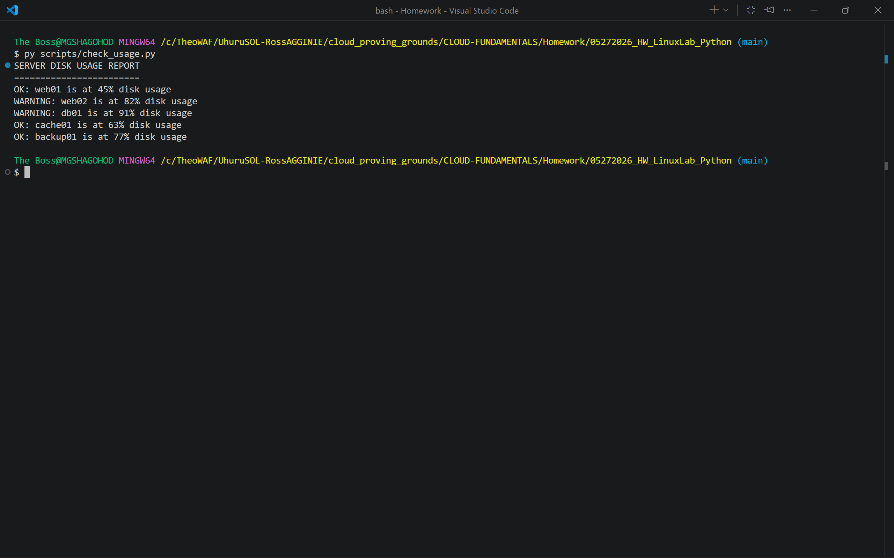
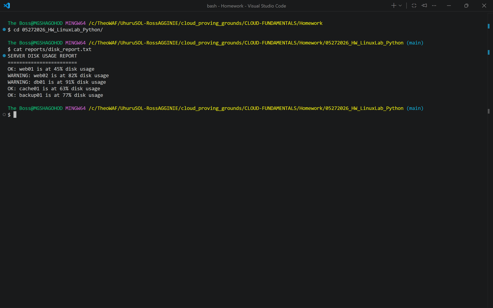
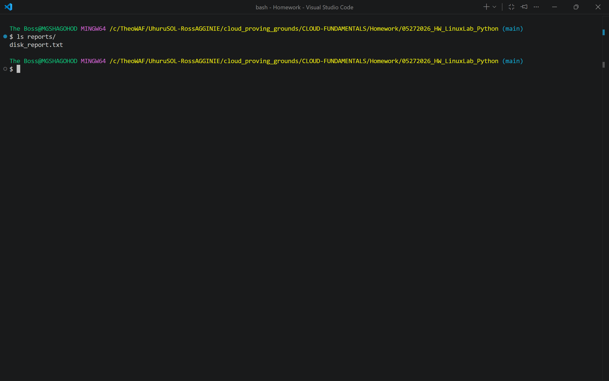

# Linux Python Lab - Server Disk Usage Audit Tool


A lightweight disk-usage auditing tool for Linux lab environments.
A Bash driver script locates a Python interpreter, runs a Python reader
that checks server disk usage against a configurable threshold, pipes the
output to a timestamped report file, and rotates old reports automatically.

**Note:** This tool reads pre-collected CSV data. It does NOT collect live
system metrics. No third-party packages are required (pure Python stdlib).

---

## Project Structure

```
05272026_HW_LinuxLab_Python/
 run_audit.sh                         # Bash driver
 scripts/
    check_usage.py                   # Python reader
 data/
    server_usage.txt                 # Input CSV
 reports/
    disk_report_YYYYMMDD_HHMMSS.txt  # Timestamped output
    disk_report_latest.txt           # Latest copy
 deliverables/
    screenshots/                     # Lab evidence
    README.md                        # Deliverables index
 requirements.txt
 .gitignore
 LICENSE
```

---

## How It Works

1. `run_audit.sh` discovers the first available Python interpreter
2. 2. Verifies that `data/server_usage.txt` exists
   3. 3. Runs `scripts/check_usage.py`, piping output with `tee` to a timestamped report
      4. 4. Copies the result to `reports/disk_report_latest.txt` for quick access
         5. 5. Rotates old reports  only the 10 most recent are kept
           
            6. ---
           
            7. ## Quick Start
           
            8. ```bash
               # 1. Clone the repo
               git clone https://github.com/GodEmperorKing/05272026_HW_LinuxLab_Python.git
               cd 05272026_HW_LinuxLab_Python

               # 2. Make the driver executable (first time only)
               chmod +x run_audit.sh

               # 3. Run the full audit
               ./run_audit.sh
               ```

               Run the Python script directly with custom options:

               ```bash
               # Default (data/server_usage.txt, 80% threshold)
               python3 scripts/check_usage.py

               # Custom file path
               python3 scripts/check_usage.py --file data/server_usage.txt

               # Custom threshold
               python3 scripts/check_usage.py --file data/server_usage.txt --threshold 90
               ```

               ---

               ## Input File Format

               `data/server_usage.txt`  plain CSV, no header, one server per line:

               ```
               web-01,75
               web-02,92
               db-01,55
               db-02,81
               ```

               ---

               ## Sample Output

               ```
               SERVER DISK USAGE REPORT
               ========================================
                 OK:      web-01 is at 75% disk usage
                 WARNING: web-02 is at 92% disk usage
                 OK:      db-01 is at 55% disk usage
                 WARNING: db-02 is at 81% disk usage
               ========================================
               ```

               ---

               ## File Reference

               | File / Folder | Purpose |
               |---|---|
               | `run_audit.sh` | Bash driver: finds Python, runs audit, writes and rotates reports |
               | `scripts/check_usage.py` | Python reader: parses CSV, compares usage to threshold, prints status |
               | `data/server_usage.txt` | Input data: comma-separated server name and disk usage percent |
               | `reports/` | Auto-generated audit output (timestamped + latest copy) |
               | `deliverables/screenshots/` | Lab evidence screenshots |
               | `.gitignore` | Ignores __pycache__, *.pyc, venv/, generated reports, OS artifacts |
               | `requirements.txt` | Empty - no third-party dependencies |

               ---

               ## Requirements

               - **Python 3.x** - standard library only (`argparse`, `sys`). No pip install needed.
               - - **Bash** - any POSIX-compatible shell on Linux or macOS
                
                 - ---

                 ## Screenshots

                 | Screenshot | Description |
                 |---|---|
                 |  | Running `run_audit.sh` end-to-end |
                 |  | `check_usage.py` executing directly |
                 |  | Contents of generated report file |
                 |  | Timestamped reports in `reports/` folder |

                 ---

                 ## Learning Objectives Demonstrated

                 - Python file I/O with error handling (`try/except`, `FileNotFoundError`, `PermissionError`)
                 - - CLI argument parsing with `argparse`
                   - - Bash scripting: interpreter discovery, `set -euo pipefail`, `tee`, log rotation
                     - - Cross-script integration (Bash invoking Python)
                       - - Clean code: shebang, docstrings, `__main__` guard, `sys.stderr` for errors
                        
                         - ---

                         ## Lab Info

                         | Field | Value |
                         |---|---|
                         | Submitted | May 27, 2026 |
                         | Author | GodEmperorKing |
                         | Course | Linux Lab - Python Integration |

                         ---

                         ## License

                         MIT - see [LICENSE](LICENSE) for details.
                         
